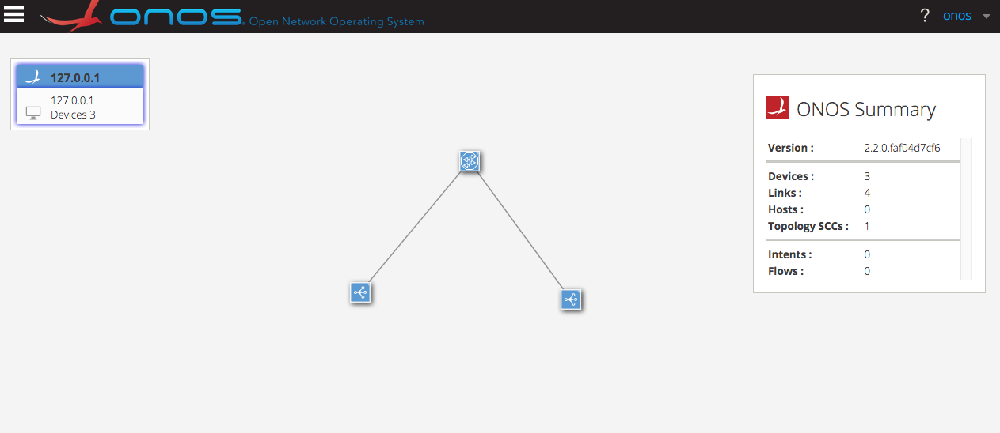
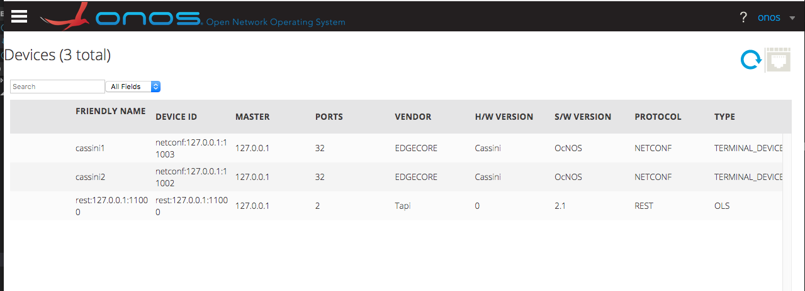
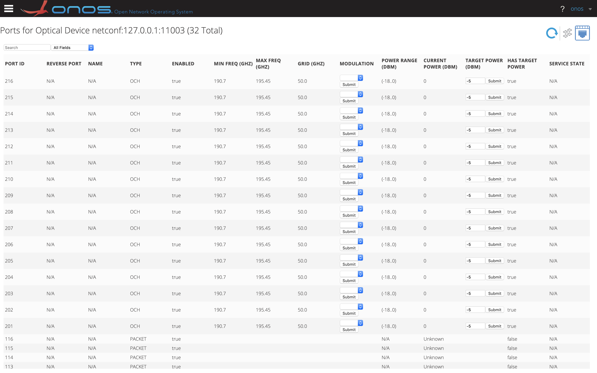

# GUI for ODTN

##  Environment Setup and Topology Discovery 
Follow the instructions posted [How to build and run ODTN Emulators?](README.md) to setup your environment and push device and link info to ONOS.

## GUI2 View
1. First, open the home (topology) page of ONOS using by visiting [ONOS GUI](http://localhost:8181/onos/ui). You should be able to see the following output if you setup your enviroment and push topology info properly. 

2. Second, open the roadm custom view page by visiting [Roadm View](http://localhost:8181/onos/ui/#/roadm-gui). You should be able to see the following output:

3. Third, select one of the devices and click the icon on the top-right to see the port details for that device. For example, you can see the port details for Cassini1 here:[Port Details For Cassini1](http://localhost:8181/onos/ui/#/roadm-gui/roadm-port-gui?devId=netconf:127.0.0.1:11003). You should be able to see the following output: 

4. On the TARGET POWER column, we can type in the power value to modify the power of specific port. For example, we change the power from -5 to -10 as the following Figure illustrates:

However, if the value is out of the available range, the alert appears.

